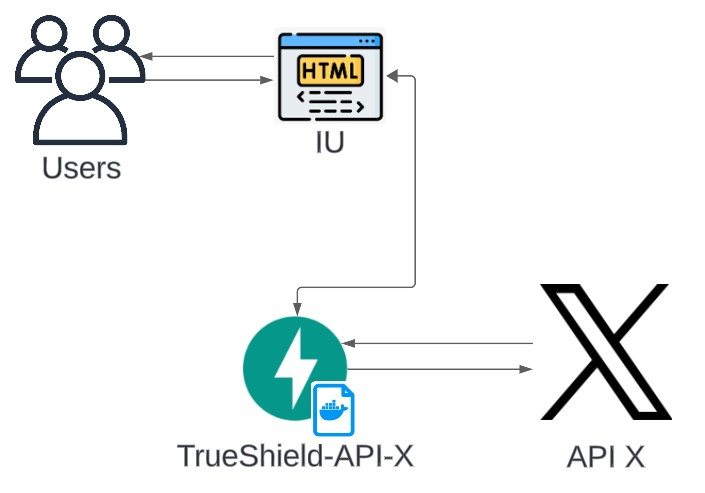

# API X

## Introducción de la API

Esta API permite la búsqueda de tweets a través de diferentes palabras clave. La API está desarrollada con **FastAPI** y utiliza `Twikit` para la consulta de datos desde X.

## Diagrama de arquitectura



## ¿Cómo está dividida la API?

### Estructura del proyecto

- `models/`
  - `models.py` - Archivo que contiene los modelos de la clase.
- `routes/`
  - `x.py` - Archivo que contiene las rutas de la API.
- `services/`
  - `x.py` - Archivo que contiene todas las funciones de lógica.
- `main.py` - Archivo principal de la API donde se incluyen las rutas.
- `requirements.txt` - Archivo con las librerías y paquetes necesarios.
- `config.ini` - Archivo que contiene las credenciales necesarias para la conexión con X.

> [!TIP]
> Mantener una estructura modular del proyecto facilita el mantenimiento y la escalabilidad del mismo.

### Componentes

`main.py`: Contiene la configuración principal de **FastAPI** y la inclusión de las rutas desde el módulo `routes`.

`models/models.py`: Definición del modelo de datos utilizando **Pydantic**.

`routes/reddit.py`: Definición de la ruta de la API.

**Rutas:**
- `/contrasting`: Realiza una búsqueda de tweets en X basada en un conjunto de palabras clave y devuelve los más relevantes.

`services/reddit.py`: Contiene la lógica para la consulta de tweets en X y el procesamiento de los resultados.

## Ejecutemos la API

### Iniciamos un entorno virtual (Opcional)

> [!TIP]
> Usar un entorno virtual evita conflictos entre las dependencias de distintos proyectos.

- Abre una terminal y navega al directorio del proyecto.
- Crea el entorno:

```
python -m venv venv 
```

- Activa el entorno creado (Para Windows):

```
.\venv\Scripts\activate
```

### Instalamos los requerimientos

-   Cuando tengas el entorno virtual activado, puedes instalar las dependencias necesarias:

```
pip install -r requirements.txt
```

### Clonar y ejecutar

- Clonamos el repo:

```
git clone https://github.com/Lagares02/TrueShield-API-X.git
cd TrueShield-API-X
```

> [!IMPORTANT]
> No olvides configurar tus credenciales en el archivo `config.ini` para una correcta ejecución de la API.

- **Si no tienes cuenta de X, debes crear una para obtener las credenciales necesarias: (`username`, `email`, `password`)

- Configura tus variables de entorno en el archivo `config.ini`:

```
[X]
username = tu_username
email = tu_email
password = tu_password
```

- Iniciamos el servidor con tan solo:

```
py main.py
```

> [!WARNING]
> Asegúrate de que el puerto `8002` esté libre para evitar conflictos con otras aplicaciones.

- Abre tu navegador y navega a `http://127.0.0.1:8002` para ver la interfaz de usuario.